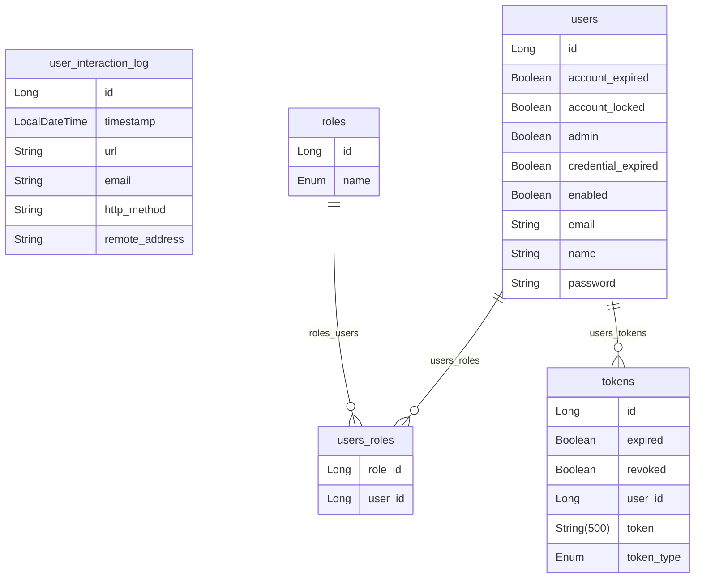

# NASA API Integration :ringed_planet: 

### **For English documentation, please refer to** [README_en.md](README_en.md).

Este proyecto es una aplicación **Spring Boot** diseñada
para integrar y consumir múltiples endpoints de la API de la NASA,
ofreciendo acceso a una variedad de datos astronómicos. Incluye autenticación
mediante JWT y una arquitectura modular para facilitar la escalabilidad
y el mantenimiento.

## Índice
1. [Descripción del Proyecto](#descripción-del-proyecto)
2. [Características](#características)
3. [Estructura del Proyecto](#estructura-del-proyecto)
4. [Requisitos Previos](#requisitos-previos)
5. [Configuración](#configuración)
6. [Paquetes del proyecto](#paquetes-del-proyecto)
   1. [Integrations](#integrations)
   2. [spring-doc](#springdoc-swagger-ui)
7. [Clases principales](#clases-principales)
8. [Documentación end-points](#documentación-de-endpoints-con-swagger-page_facing_up)
   1. [ver documentación](#acceso-a-la-documentación-end-points)
---

## Descripción del Proyecto
El proyecto integra la **NASA Open API**, permitiendo consumir y exponer
datos astronómicos, como imágenes, información sobre misiones espaciales
y datos planetarios. Proporciona una solución flexible y segura mediante
el uso de tecnologías modernas como **Spring Boot 3** y **JWT** para 
autenticación.

El enfoque modular del proyecto facilita agregar nuevos endpoints de la API
de la NASA según las necesidades del usuario o las funcionalidades requerida.

## Características
- **Consumo de múltiples endpoints de la NASA API**: Incluye servicios
como *Astronomy Picture of the Day (APOD)*, *Earth 
(Earth Imagery API)*, *Mars Rover Photos*.
- **Almacenamiento en Base de Datos**: Se implementa un esquema de base de datos, preferiblemente MySQL, para almacenar toda la información necesaria.
- **Autenticación JWT**: Seguridad para el acceso a los endpoints.
- **Estructura modular**: Fácil incorporación de nuevos servicios y funcionalidades.
- **Configuración centralizada**: Manejo de credenciales y parámetros de API desde un único archivo de configuración.
- **Extensible**: Pensado para escalar e integrar con otros servicios o APIs.

## Estructura del Proyecto
```plaintext
src/
├── main/
│   ├── java/com/sergio/nasa_api/app/
│   │   ├── auth/
│   │   │   ├── config/
│   │   │   ├── controller/
│   │   │   ├── entity/
│   │   │   ├── repository/
│   │   │   ├── services/
│   │   ├── controllers/
│   │   ├── entity/
│   │   ├── exception/
│   │   ├── integrations/nasa/
│   │   │   ├── controllers/
│   │   │   ├── services/
│   │   │   ├── repositories/
│   │   │   ├── dtos/
│   │   │   ├── config/
│   │   ├── integrations/genericconfig/
│   │   ├── integrations/genericservices/
│   │   ├── interceptors/
│   │   ├── mappers/
│   │   ├── repository/
│   │   ├── services/
│   │   ├── springdoc/
│   │   │   ├── integrations/
│   ├── resources/
│       ├── application.yml
└── test/
```
## Diagrama entidad relación




## Requisitos Previos
1. Java 17 o superior
2. Maven 3.8.1 o superior
3. Spring Boot 3
4. Postman o cualquier cliente HTTP para pruebas
5. Credenciales de la API de la NASA

## Configuración
Antes de ejecutar la aplicación, es necesario configurar las siguientes propiedades en el archivo `application.yml`:
```yaml
#data base
datasource:
  url: jdbc:mysql://<Tu host>:<Tu puerto>/<tu_base_de_datos>
  username: <tu_user_db>
  password: <tu_password_db>
#Nasa integration
nasa:
  api:
    base-url: ${NASA_URL}
    key: ${NASA_KEY}
#JWT security
application:
   security:
      jwt:
         secret-key: ${SECRET_KEY}
         expiration: 60
         refresh-token:
            expiration: 120
```
1. Debes de configurar tu base de datos ingresando host:puerto ejemplo **localhost:3306** y también el nombre de tu base de datos **localhost:3306/tu_base_de_datos**.
2. **La sección Nasa Integratión** debe ser configurada con las variables de entorno **${NASA_URL}** 
y **${NASA_KEY}** estas las puede obtener en ([Clic para obtener](https://api.nasa.gov/ "nasa api"))
3. **Nota**: La URL para **${NASA_URL}** a fecha de creación de este proyecto es: **https://api.nasa.gov**
4. **Jwt Security** se debe de configurar nuestra clave secreta para la generación de tokens de seguridad **${SECRET_KEY}**,
la duración de los tokens y el tiempo de expiración de los mismos. cabe mencionar que la clave secreta debe 
estar encriptada y configurada en las variables de entorno.

## Paquetes del proyecto

### Auth
- `com.sergio.nasa_api.app.auth`: contiene las clases que se encargan de manejar la autenticación, registro y 
refresco de tokens de seguridad.
- `com.sergio.nasa_api.app.auth.config`: contiene las configuraciones de seguridad y filtros 
de nuestra aplicación.
- `com.sergio.nasa_api.app.auth.controller`: contiene los controladores encargados de nuestra autenticación.
- `com.sergio.nasa_api.app.auth.entity`: contiene las entidades involucradas en el proceso de autenticación y seguridad.
- `com.sergio.nasa_api.app.auth.repository`: contiene la capa de acceso a datos de nuestra autenticación.
- `com.sergio.nasa_api.app.auth.services`: contiene la capa lógica de nuestra autenticación.

### Controllers
- `com.sergio.nasa_api.app.controllers`:
Contiene los controladores generales de nuestra aplicación en nuestro caso
contiene el controlador que nos permite ver las interacciones del usuario con 
los endpoints de la nasa. 

### Entity

`com.sergio.nasa_api.app.entity`:
Contiene las entidades y dtos generales de nuestra aplicación.

### Exception

`com.sergio.nasa_api.app.entity`: Contiene las exceptions de nuestra aplicación.


### Integrations
- `com.sergio.nasa_api.app.integrations`: contiene las clases que se encargan de manejar
las excepciones globales de nuestro proyecto. 
- `com.sergio.nasa_api.app.integrations`: contiene las configuraciones y servicios
generales para consumir nuestras integraciones, asi como paquetes en concreto
que se encargan de centralizar la arquitectura de nuestra integración por ahora `nasa`;
pero en el futuro pueden existir más integraciones dentro de nuestra aplicación.
- `com.sergio.nasa_api.app.integrations.genericconfig` : contiene los beans de configuración generales de nuestras integraciones.
- `com.sergio.nasa_api.app.integrations.genericservices` : contiene los servicios generales de nuestras integraciones.
- `com.sergio.nasa_api.app.integrations.nasa`: contiene la estructura de nuestra integración `config`
`controllers`,`dtos`,`repositories`,`services`.
- `com.sergio.nasa_api.app.integrations.nasa.config`: Contiene configuraciones especifícas de la integración.
- `com.sergio.nasa_api.app.integrations.nasa.controllers`: Contiene los controladores de nuestra aplicación los
cuales a su vez contiene nuestros endpoints.
- `com.sergio.nasa_api.app.integrations.nasa.dtos`: Contiene las clases DTO para respuestas.
- `com.sergio.nasa_api.app.integrations.nasa.repositories`: Contiene la capa de acceso a datos de nuestra integración.
- `com.sergio.nasa_api.app.integrations.nasa.services`: Contiene la capa lógica de nuestra integración.

### Interceptors
- `com.sergio.nasa_api.app.interceptors`: contiene los interceptores encargados de controlar las peticiones realizadas
por el usuario.

### Maper

- `com.sergio.nasa_api.app.maper`: contiene las clases de mapeo de la respuesta denuesto repositorio 
a nuestro dto de respuesta. 

### Repository

- `com.sergio.nasa_api.app.repository`: contiene nuestro repositorio para interactuar con nuestra entidad UserInteractionLog

### Services

- `com.sergio.nasa_api.app.services`: contiene nuestro servicio para interactuar con nuestro repositorio.


### SpringDoc (swagger-ui)

- `com.sergio.nasa_api.app.springdoc`: Contiene los paquetes y clases para documentar los endpoints de
nuestra aplicación.
- `com.sergio.nasa_api.app.springdoc.integrations`: contiene las interfaces de documentación para los controladores 
de nuestras integraciones.

## Clases principales
A continuación se describe algunas de las clases principales de la aplicación.

### `AuthController` :
Contiene los endpoints para autenticación y registro de usuarios.

### `JwtAuthenticationFilter` :
Filtro que intercepta las peticiones HTTP y verifica la presencia de un token JWT válido.

### `BeansInjectorConfig` :
Clase que inyecta los beans de configuración para la autenticación de nuestra aplicación.

### `SpringSecurityConfig` :  
Clase que configura la seguridad de nuestra aplicación.

### `WebClientConfig` :
Clase que inyecta el componente del cliente Http para consumir o integrar apis propias o externas 
en este caso se usó WebClient que es un componente de spring web-flux. Cabe mencionar que se puede usar otro cliente como
**RestTemplate**

### `HttpClientServiceImpl`:
Implementa una interfaz genérica la cual nos permite realizar peticíones: *POST*, *PUT*, *DELETE* y *GET* a través de la inyección
de nuestro componente WebClient registrado en el contenedor de spring en la clase WebClientConfig.

### `NasaApiConfig` :
Genera los parámetros requeridos para hacer la petición a la url de nuestra integración.

### `NasaRepositoryImpl` : 
Repositorio que interactúa con la API de la NASA para obtener información de distintos datos 
astronómicos.

### `NasaServiceImpl` :
Define operaciones que permiten la interacción con el repository.

## Documentación de Endpoints con Swagger :page_facing_up:

La documentación de los endpoints de la aplicación se realizó utilizando **Swagger**, una herramienta que facilita la creación, visualización y mantenimiento de documentación interactiva para APIs REST.

La configuración global de Swagger se encuentra en el paquete:  
`com.sergio.nasa_api.app.springdoc`.

### Acceso a la documentación (End-Points)
Una vez que la aplicación esté en **ejecución**, puede acceder a la documentación de los endpoints a través de la siguiente URL:  
[Swagger Documentation](http://localhost:8080/swagger-ui/index.html#/ "Endpoints").


