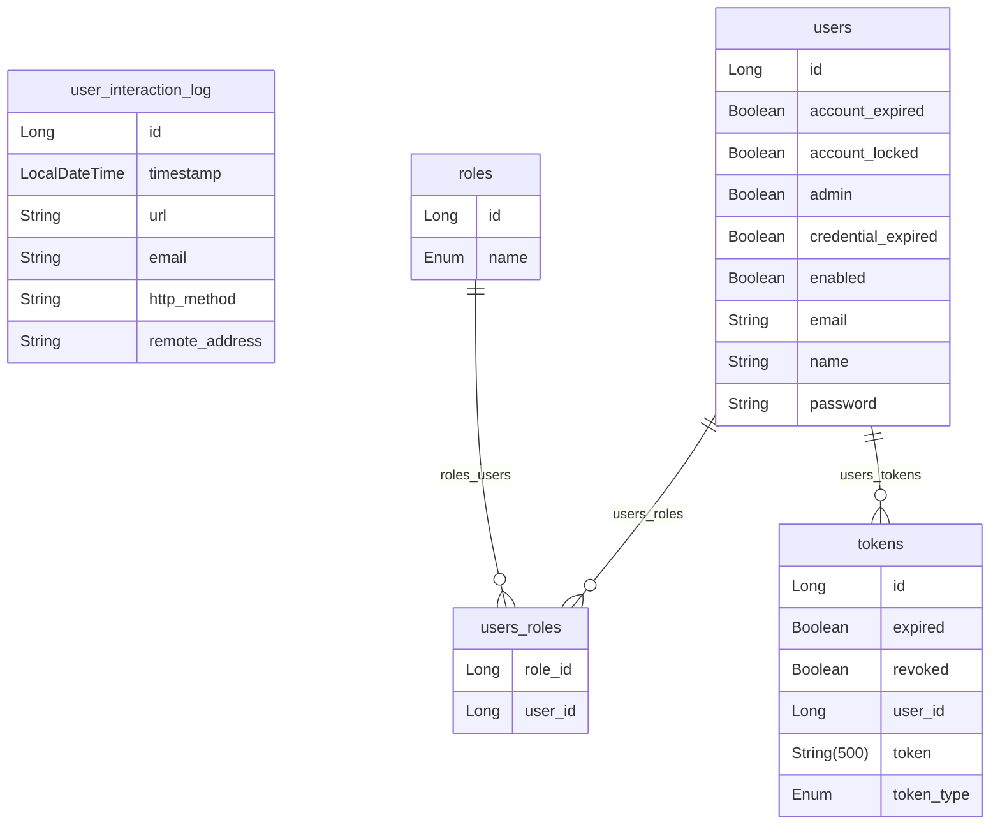

# NASA API Integration :ringed_planet:

This project is a **Spring Boot** application designed
to integrate and consume multiple endpoints from the NASA API,
offering access to a variety of astronomical data. It includes authentication
via JWT and a modular architecture to ensure scalability
and maintainability.

## Table of Contents

1. [Project Description](#project-description)
2. [Features](#features)
3. [Project Structure](#project-structure)
4. [Prerequisites](#prerequisites)
5. [Configuration](#configuration)
6. [Project Packages](#project-packages)
    1. [Integrations](#integrations)
    2. [spring-doc](#springdoc-swagger-ui)
7. [Main Classes](#main-classes)
8. [Endpoints Documentation](#endpoints-documentation-with-swagger-page_facing_up)
    1. [View Documentation](#access-to-endpoints-documentation)

---

## Project Description

This project integrates the **NASA Open API**, enabling the consumption and exposure
of astronomical data, such as images, mission details, and planetary information. It provides a flexible and secure
solution using modern technologies like **Spring Boot 3** and **JWT** for authentication.

The modular approach facilitates the addition of new NASA API endpoints as per user needs or required functionalities.

## Features

- **Consumption of multiple NASA API endpoints**: Includes services like *Astronomy Picture of the Day (APOD)*, *Earth
  (Earth Imagery API)*, *Mars Rover Photos*.
- **Database Storage**: Implements a database schema, preferably MySQL, to store all the required information.
- **JWT Authentication**: Ensures security for endpoint access.
- **Modular Architecture**: Simplifies the incorporation of new services and features.
- **Centralized Configuration**: Handles API credentials and parameters from a single configuration file.
- **Extensible**: Designed to scale and integrate with other services or APIs.

## Project Structure

```plaintext
src/
├── main/
│   ├── java/com/sergio/nasa_api/app/
│   │   ├── auth/
│   │   │   ├── config/
│   │   │   ├── controller/
│   │   │   ├── entity/
│   │   │   ├── repository/
│   │   │   ├── services/
│   │   ├── controllers/
│   │   ├── entity/
│   │   ├── exception/
│   │   ├── integrations/nasa/
│   │   │   ├── controllers/
│   │   │   ├── services/
│   │   │   ├── repositories/
│   │   │   ├── dtos/
│   │   │   ├── config/
│   │   ├── integrations/genericconfig/
│   │   ├── integrations/genericservices/
│   │   ├── interceptors/
│   │   ├── mappers/
│   │   ├── repository/
│   │   ├── services/
│   │   ├── springdoc/
│   │   │   ├── integrations/
│   ├── resources/
│       ├── application.yml
└── test/
```

## Entity-Relationship Diagram


## Prerequisites

1. Java 17 or higher
2. Maven 3.8.1 or higher
3. Spring Boot 3
4. Postman or any HTTP client for testing
5. NASA API credentials

## Configuration
Before running the application, configure the following properties
in the `application.yml` file:

```yaml
#data base
datasource:
  url: jdbc:mysql://<Tu host>:<Tu puerto>/<tu_base_de_datos>
  username: <tu_user_db>
  password: <tu_password_db>
#Nasa integration
nasa:
  api:
    base-url: ${NASA_URL}
    key: ${NASA_KEY}
#JWT security
application:
   security:
      jwt:
         secret-key: ${SECRET_KEY}
         expiration: 60
         refresh-token:
            expiration: 120
```

### Configure Your Database

1. **Database Configuration**: Enter the host:port, for example, `localhost:3306`, and the database name `localhost:3306/your_database`.

2. **NASA Integration Configuration**:
   - Use the environment variables `${NASA_URL}` and `${NASA_KEY}`.
   - Obtain these variables from the [NASA API Portal](https://api.nasa.gov/).
   - **Note**: As of the project creation date, the URL for `${NASA_URL}` is: `https://api.nasa.gov`.

3. **JWT Security Configuration**:
   - Set a secret key `${SECRET_KEY}` for generating security tokens.
   - Define token duration and expiration times.
   - Ensure the secret key is encrypted and set up in the environment variables.

---

### Project Packages

#### Auth
- **`com.sergio.nasa_api.app.auth`**: Contains classes for authentication, registration, and security token refresh.
- **`com.sergio.nasa_api.app.auth.config`**: Manages security configurations and filters for the application.
- **`com.sergio.nasa_api.app.auth.controller`**: Contains controllers for authentication processes.
- **`com.sergio.nasa_api.app.auth.entity`**: Defines entities related to authentication.
- **`com.sergio.nasa_api.app.auth.repository`**: Provides the data access layer for authentication.
- **`com.sergio.nasa_api.app.auth.services`**: Contains business logic for authentication.

#### Controllers
- **`com.sergio.nasa_api.app.controllers`**: Manages general application controllers, including logging user interactions with NASA endpoints.

#### Entity
- **`com.sergio.nasa_api.app.entity`**: Defines general entities and DTOs for the application.

#### Exception
- **`com.sergio.nasa_api.app.exception`**: Manages application-level exceptions.

#### Integrations
- **`com.sergio.nasa_api.app.integrations`**: Handles global exceptions and configurations for integrations.
- **`com.sergio.nasa_api.app.integrations.genericconfig`**: Contains general configuration beans for integrations.
- **`com.sergio.nasa_api.app.integrations.genericservices`**: Provides generic services for integrations.
- **`com.sergio.nasa_api.app.integrations.nasa`**: Manages NASA integration configurations, controllers, DTOs, repositories, and services.

#### Interceptors
- **`com.sergio.nasa_api.app.interceptors`**: Manages user request handling using interceptors.

#### Mapper
- **`com.sergio.nasa_api.app.mapper`**: Maps repository data to response DTOs.

#### Repository
- **`com.sergio.nasa_api.app.repository`**: Provides repository support for interacting with the `UserInteractionLog` entity.

#### Services
- **`com.sergio.nasa_api.app.services`**: Contains services for interacting with repositories.

#### SpringDoc (Swagger-UI)
- **`com.sergio.nasa_api.app.springdoc`**: Manages packages and classes for documenting API endpoints.
- **`com.sergio.nasa_api.app.springdoc.integrations`**: Documents integration controllers.

---

### Main Classes

#### **AuthController**
- Manages endpoints for user authentication and registration.

#### **JwtAuthenticationFilter**
- Intercepts HTTP requests and validates JWT tokens.

#### **BeansInjectorConfig**
- Injects configuration beans for application authentication.

#### **SpringSecurityConfig**
- Configures the application's security.

#### **WebClientConfig**
- Injects the HTTP client component for API consumption using **WebClient**.

#### **HttpClientServiceImpl**
- Implements generic requests (POST, PUT, DELETE, GET) using the **WebClient** component.

#### **NasaApiConfig**
- Generates parameters required for NASA API requests.

#### **NasaRepositoryImpl**
- Interacts with the NASA API to fetch astronomical data.

#### **NasaServiceImpl**
- Defines operations for interacting with the repository.

---

### Endpoints Documentation with Swagger :page_facing_up:

- Documentation is generated using **Swagger**, which facilitates creating, visualizing, and maintaining interactive REST API documentation.

- The global Swagger configuration can be found in:  
  **`com.sergio.nasa_api.app.springdoc`**.

#### Access to Endpoints Documentation
- Once the application is running, access the endpoint documentation at:  
  [Swagger Documentation](http://localhost:8080/swagger-ui/index.html#/).
